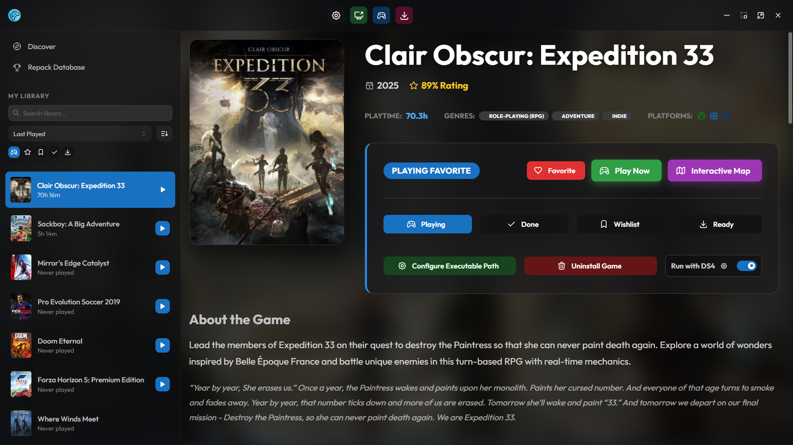
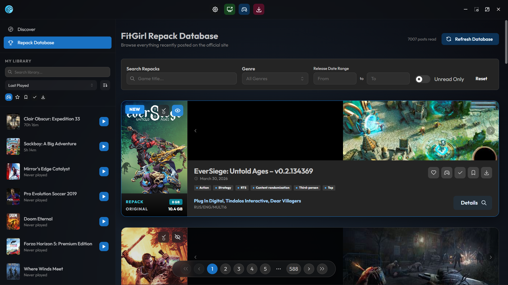
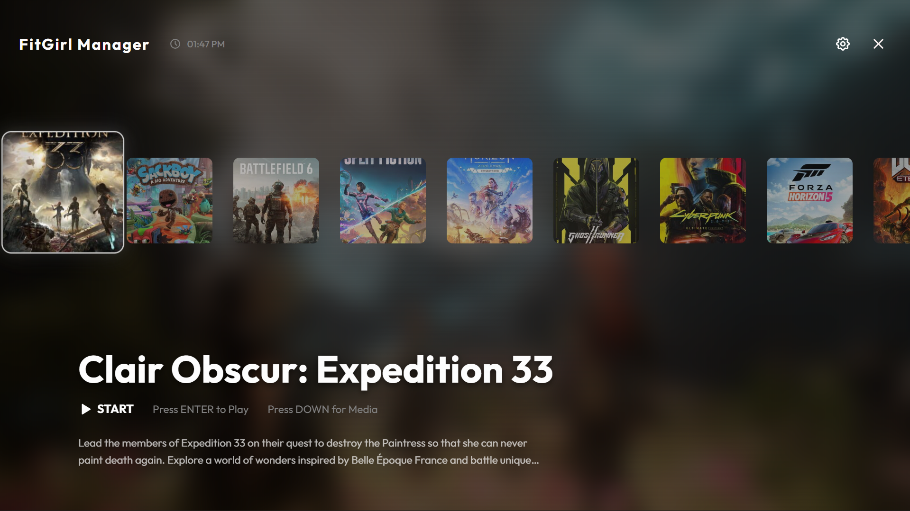

# FitGirl Repacks Manager

**FitGirl Repacks Manager** is a modern, high-performance desktop application designed to streamline your gaming experience. It provides a beautiful interface to discover, manage, and install your favorite games directly from FitGirl's catalog.

---

## Key Features

- **Modern Dashboard**: Instantly access the latest repacks and manage your library from a sleek, unified interface.
- **Smart Discovery**: Browse the entire FitGirl catalog.
- **One-Click Extraction**: Automated handling of RAR and 7Z archives for a hassle-free installation process.
- **Library Management**: Track your collection, record play times, and manage installation status effortlessly.

## Screenshots

  
   
  <em><b>Modern Library</b>: Organized and intuitive game collection management.</em>

  
   
  <em><b>Rich Details</b>: All the information you need, directly from FitGirl and IGDB.</em>

  
   
  <em><b>Immersive Experience</b>: Clean fullscreen mode for browsing your collection.</em>

---

## Getting Started

1.  Visit the [**Releases**](https://github.com/ANOOBALSA/FitGirl-Repacks-Manager/releases) page.
2.  Download the latest `FitGirl Repacks Manager - v0.1.0.exe` installer.
3.  Run the installer.
4.  Launch the app and start building your library!

---

## Disclaimer

This application is a management tool and does not host or distribute any copyrighted content. It simplifies the process of interacting with publicly available repacks. Users are responsible for ensuring they comply with local laws and regulations regarding the use of such content.

---

## Credits

- Game Data powered by [IGDB](https://www.igdb.com/)
- Repacks by [FitGirl](https://fitgirl-repacks.site/)
- UI Framework: [Mantine](https://mantine.dev/)

---

  Made with ❤️ by <b><a href="https://github.com/ANOOBALSA">ANOOBALSA</a></b>

